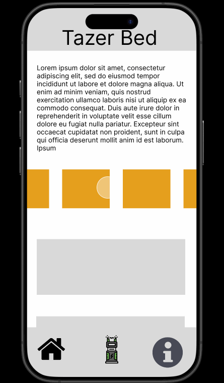
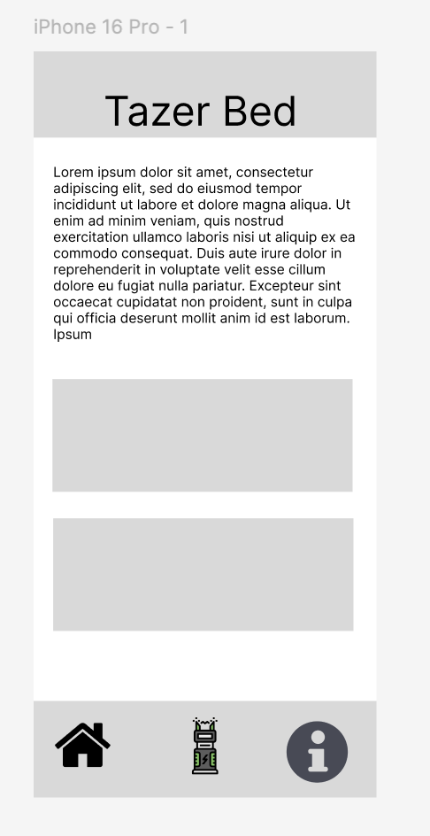
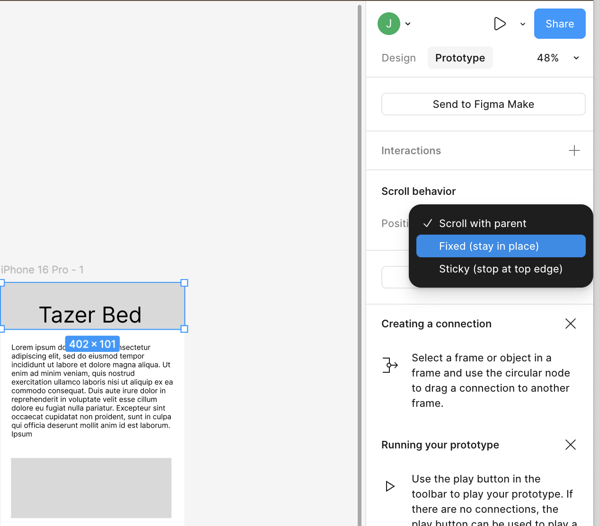
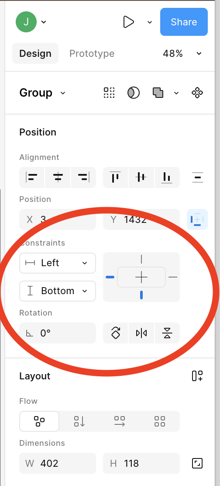
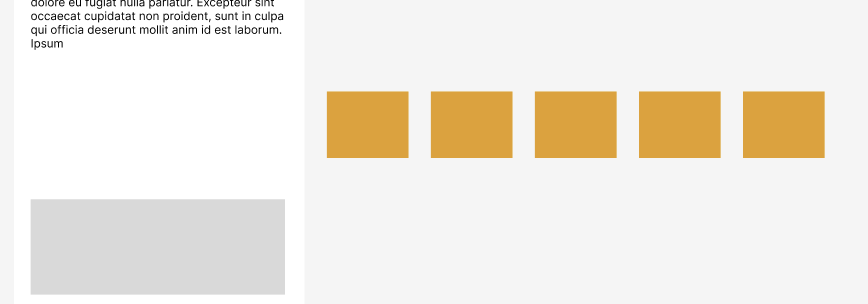
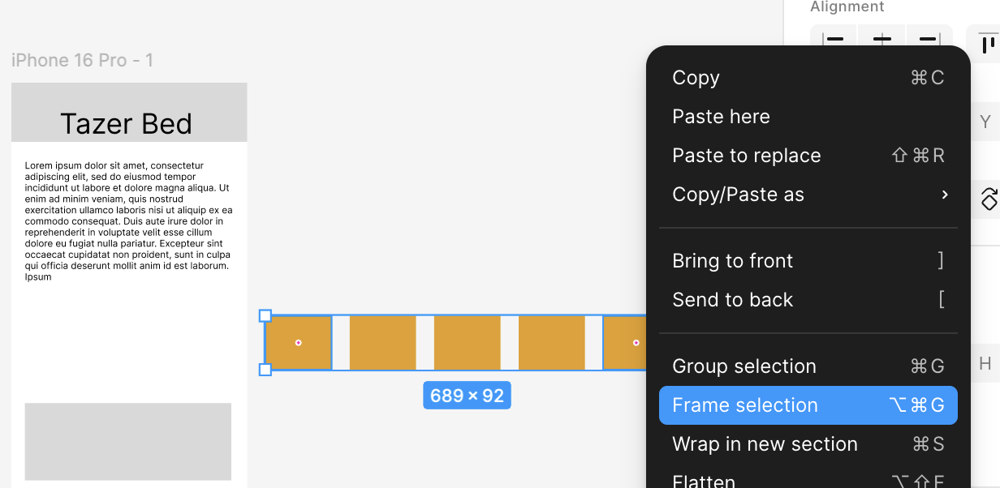
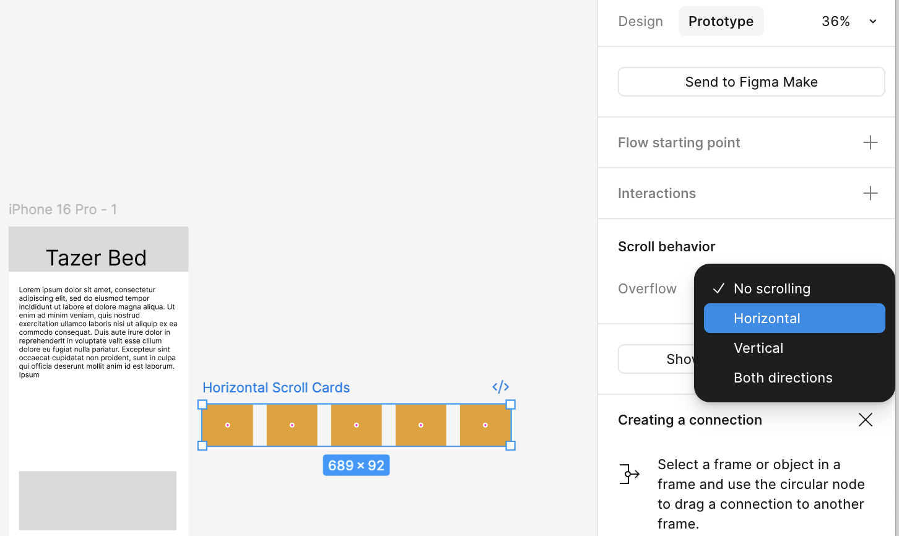
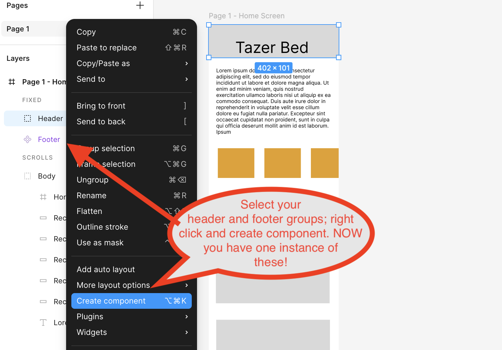
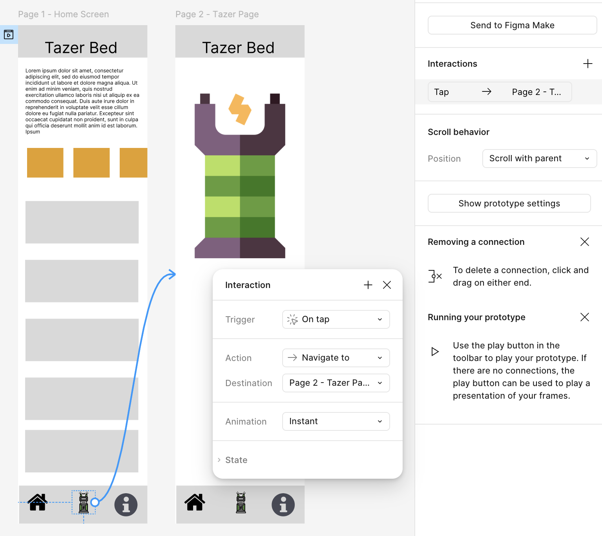

# Figma Prototyping Walkthrough - Tazer Bed Guide

> This is a step-by-step companion to the [Figma Prototyping Exercise](figma-prototyping-exercise.md). It covers the same four interaction patterns as the [YouTube tutorial](https://www.youtube.com/watch?v=v1UKB-0EUhQ) but uses a themed example - a fictional product called "Tazer Bed" from an IGME 110 project.
>
> **The Figma techniques are identical.** If you'd rather follow the video and build a generic app, go for it. This guide is here if you prefer written steps with screenshots, or want a reference to come back to when you get stuck.

**Time estimate:** 45-60 minutes

**What you need:** A Figma account (Education plan recommended - [setup instructions](https://docs.google.com/document/d/1nlwsaJXJozfZu4VocByOHxetIghnsTwGtABZgRNFOCc/edit?usp=sharing))

---

## What You'll Build

A clickable mobile prototype with vertical scrolling, horizontal scrolling, multi-page navigation, and a modal overlay.

---

## Step 1: Create a New File and Frame

1. Create a new Figma **Design** file
2. Name it "Prototype Practice" (or whatever you'd like)
3. Press `F` to create a frame
4. In the right panel, select a mobile phone size that matches your device (e.g., iPhone 16 Pro, Pixel 8)

> **Tip:** Choosing the right frame size from the start means the prototype preview will match your actual phone screen.

---

## Step 2: Build the Header

1. Press `R` to create a rectangle at the top of the frame
2. Change the fill color to a dark gray (something like `#333333`)
3. Press `T` to add a text box on top of the rectangle
4. Type your header text (e.g., "Tazer Bed" or "My App" - whatever you want)
5. Change the text color to white so it's readable
6. Adjust font size and center it

> **Tip:** Dark background + light text = clear visual hierarchy. This is a wireframe, so don't spend too long on styling.

---

## Step 3: Create the Tab Bar

1. Copy the header rectangle (`Cmd/Ctrl + C`, then `Cmd/Ctrl + V`)
2. Move it to the bottom of the screen - this is your tab bar
3. Press `R` and create 3 small rectangles on the tab bar to represent icons
4. Space them evenly across the bar

> **Tip:** Keep the tab bar around 60-80px tall. These placeholder rectangles represent icons - you can swap them for real icons later if you want, but plain shapes work fine for a wireframe.

---

## Step 4: Add Content Cards

1. Press `R` to create a rectangle in the content area (between header and footer)
2. Copy and paste it to create 3 cards total
3. Space them vertically with some breathing room (~16-20px gaps)

---

## Step 5: Generate Your First Prototype Link

1. Click the **Prototype** tab in the top right panel
2. Set the device to your mobile phone type
3. Select the entire frame
4. Click the **Play** button (triangle icon) in the top right

You now have a prototype! It's not interactive yet, but you can click **Share Prototype** to get a shareable link.

---

## Checkpoint: Basic Wireframe

You should have a mobile frame with a dark header, 3 content cards, and a tab bar with 3 icon placeholders.

---

## Step 6: Enable Vertical Scrolling

Right now everything fits on one screen. To make the page scroll:

1. Zoom out a bit and select the frame
2. Drag the **bottom edge** of the frame down to make it taller
3. Select the tab bar group and drag it down to the new bottom
4. Copy one of the cards and paste several more to fill the extended space
5. Adjust the frame height so cards fill the full page

Go back to the prototype preview - the page should scroll vertically now. But you'll notice the header and footer scroll away with the content. We'll fix that next.

---

## Step 7: Fix the Header (Sticky Position)

1. Select all the header elements (rectangle + text)
2. Group them: right-click > **Group Selection** (or `Cmd/Ctrl + G`)
3. With the group selected, find the **"Fixed position when scrolling"** checkbox in the right panel and check it

The header will now stay pinned to the top while content scrolls beneath it.

> **Watch out:** Fixed position only works on grouped elements. If it's not working, make sure you grouped first.

> **Can't find the setting?** Check if you're in **Draw mode**. Draw mode hides the Design panel and causes all kinds of confusion. Look at the bottom toolbar on the right side and switch back to **Design mode**. If the right panel looks empty or wrong, this is almost always the reason.

---

## Step 8: Fix the Footer (Sticky Position)

1. Select all the tab bar elements (rectangle + icon placeholders)
2. Group them (`Cmd/Ctrl + G`)
3. In the right panel, change the **constraint** so it's pinned to the **bottom** (not top)
4. Check the **"Fixed position when scrolling"** box

> **Note:** The constraint settings have moved around in recent Figma updates. Look in the **Design** tab when your group is selected. You need to find the position/constraint area and set it to stick to the bottom. It may not be labeled "Constraint" anymore, but the setting is there.

---

## Checkpoint: Scrolling Works

Test your prototype:
- Page scrolls vertically
- Header stays fixed at the top
- Footer stays fixed at the bottom
- Content scrolls between them

---

## Step 9: Prepare for Horizontal Scrolling

Now we'll make a row of cards that scrolls horizontally (like a carousel).

1. Select the **first card** in your content area and make it narrower (~60-70% of the frame width)
2. Copy and paste to create several cards **side by side** (not stacked vertically)
3. Select **all** the horizontal cards
4. **Drag them out of the main frame** temporarily - just off to the side

> **Why pull them out?** We need to wrap these in their own frame first. Trying to set up horizontal scroll while they're still inside the main frame won't work.

---

## Step 10: Frame the Horizontal Section

1. With all the horizontal cards selected, right-click > **Frame Selection**
2. This creates a new frame around just those cards
3. **Drag this new frame back** into the main mobile frame
4. Position it where you want the horizontal scroll area

---

## Step 11: Enable Horizontal Scrolling

1. Select the **cards frame** (the container, not individual cards)
2. Resize the frame width to match the phone width - the cards should overflow past the right edge
3. In the right panel, check **"Clip content"** - this hides the overflow
4. Switch to the **Prototype** tab and set **Overflow** to **Horizontal scrolling**

> **Key:** The frame width must be smaller than the total width of all the cards inside it. If the cards fit without overflowing, there's nothing to scroll.

---

## Checkpoint: Horizontal Scroll

Test your prototype:
- Page still scrolls vertically (header/footer fixed)
- The card row scrolls horizontally
- You can adjust the frame size without squishing the cards

---

## (Optional) Step 11.5: Make Header & Footer Into Components

This is optional but **highly recommended** before you start duplicating pages in the next steps.

1. Select your header group
2. Right-click > **Create Component**
3. Do the same for your footer/tab bar group

Now when you copy a page, the header and footer become **instances** of the component. Edit the original once, and every copy updates automatically. This is a huge time saver when you have multiple pages.

> **Tip from the video:** If you have a shared element across many screens, always make it a component. This is a professional workflow habit worth building now.

---

## Step 12: Create a Second Page

1. Double-click the frame name and rename it to **"Page 1"** (or "Page 1 - Home Screen")
2. Copy the entire frame (`Cmd/Ctrl + C`, then `Cmd/Ctrl + V`)
3. Place the copy next to Page 1
4. Rename it **"Page 2"**
5. Keep the header and footer, but change the content to make it visually different - rearrange rectangles, add new ones, whatever makes it clearly a different screen

---

## Step 13: Create Navigation (Page 1 to Page 2)

1. Make sure the **Prototype** tab is selected in the right panel
2. On Page 1, select one of the **tab bar icons**
3. Hover over it - you'll see a small blue circle (connection point) appear on the edge
4. **Drag that blue circle** to Page 2's frame and release

You've created a navigation interaction. When someone taps that icon in the prototype, they'll jump to Page 2.

> **Watch out:** Make sure you're dragging the blue circle, not the element itself. It's a small target.

---

## Step 14: Create Return Navigation (Page 2 to Page 1)

1. On Page 2, select a **different icon** on the tab bar
2. Drag its blue circle to **Page 1**

Now you can click back and forth between pages using the tab bar icons.

### Alternative Method

You can also create navigation without dragging:
1. Select the icon
2. In the Prototype panel, click **"+ Add Interaction"**
3. Change the action from "None" to **"Navigate to"**
4. Select your destination page

Same result, just a different way to set it up. This method is handy for more complex interactions.

---

## Checkpoint: Navigation

Test your prototype:
- Tapping tab icons moves between Page 1 and Page 2
- Navigation feels instant
- Both directions work

---

## Step 15: Create a Modal Frame

1. Press `F` to create a new frame - **smaller than your mobile screen** (about 70-80% of the width)
2. Position it near your pages (it doesn't need to be on top of them)
3. Add rectangles to build a simple modal layout:
   - A background rectangle
   - A close icon (X) in the top right corner
   - Some content area

> **Tip:** Modals should be visibly smaller than full screen so it's clear they're overlays, not new pages.

---

## Step 16: Wire Up the Overlay

1. Go to **Page 2** (or whichever page you want the modal to trigger from)
2. Select an icon or element to be the trigger
3. In the **Prototype** tab, drag the blue circle to your **modal frame**
4. In the interaction details, change the action from **"Navigate to"** to **"Open overlay"**
5. Check both boxes:
   - **"Add background behind overlay"** - dims the page behind the modal
   - **"Close when clicking outside"** - lets users dismiss by tapping outside

---

## Step 17: Add a Close Button to the Modal

1. Select the **close icon** (X) in your modal
2. In the Prototype tab, click **"+ Add interaction"**
3. Set the action to **"Close overlay"**

Now users can close the modal two ways: clicking the X, or clicking outside the modal. Always provide both options - it's a basic usability expectation.

---

## Checkpoint: Modal Overlay

Test your prototype:
- Tapping the trigger element opens the modal
- The background dims behind the modal
- Clicking outside the modal closes it
- Clicking the X icon closes it
- The original page is still there underneath

---

## Bonus Tips

### Test on Your Phone
1. Download the **Figma app** on your mobile phone
2. Open the app and log in
3. Tap **Mirror** (bottom right)
4. Select any frame on your laptop

Your prototype appears on your phone in real-time. This is the best way to experience what you're designing.

### Shadow Testing
Once you share your prototype link with someone:
1. Open the same prototype link yourself
2. When they start interacting with it, click their profile photo in the top right
3. Select **Shadow** - you'll see everything they do in real-time

This is incredibly useful for user testing (which you'll be doing for your project prototype).

---

## What You've Learned

These four patterns - vertical scroll, horizontal scroll, page navigation, and overlays - are the foundation of interactive prototyping. Every mobile app you use combines these interactions in different ways. Now you know how to build them in Figma.

**Next up:** You'll apply these skills to your group's Lo-Fi Prototype (due Mon Apr 13).
